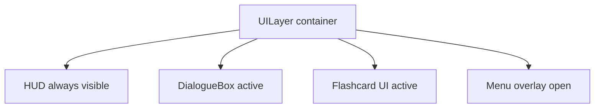

# Phase 2 UI Redesign Specification

## Summary
Define the Phase 2 UI redesign plan for Kimbar. Scope includes a unified UI layer hierarchy, asset requirements, responsive layout rules, and an ordered implementation plan that respects UI isolation and registry-first content loading.

## Preflight Protocol
### Rule files acknowledged
- .roo/rules/00_READ_FIRST.md
- .roo/rules/01_GATES.md
- .roo/rules/02_UI.md
- .roo/rules/03_WORLD_DOORS.md
- .roo/rules/04_PROPS_ASSETS.md
- .roo/rules/01-invariants.md (deprecated stub)

### Top five binding invariants
1. UI isolation via WorldScene.getUILayer, no scrollFactor hacks.
2. Registry-first content loading, no hardcoded /content paths outside the central loader.
3. Deterministic pipelines for generated artifacts.
4. Agent-friendly workflow via npm scripts and validators.
5. MCP controlled usage only on allowlisted read-only tools.

### MCP usage
No MCP tools used in this plan. If MCP is needed later, only allowlisted read-only tools are permitted.

### Impacted subsystems
- UI layer composition and HUD layout.
- UI primitives (UIPanel, UIButton, UILabel, UIChoiceList).
- DialogueSystem UI container and layout.
- Flashcard UI overlay.
- Content registry updates for UI assets.
- UI validation and unit tests.

### Validators to consider
- npm run check-boundaries
- npx tsc --noEmit
- npm run test:unit
- npm run test:e2e (if UI flow changes affect gameplay)
- npm run validate:tiled
- npm run build:tiled
- npm run verify
- npm run dev (manual scene validation)

Gate note: This planning task runs npm run check:fast only, since no runtime code changes are applied in Phase 2 planning.

## Context
Existing UI components and tokens are code-first and use uiTheme and constants. The current plan reuses the existing uiTheme palette and font sizes without introducing new typography sizing.

## Component Hierarchy
UI Layer hierarchy for Phase 2:

### HUD contents
- StatsPanel showing citations, tokens, sanctions.
- OutfitDisplay with current outfit preview.
- MenuButton for overlay toggles.

### Overlays
- DialogueBox: uses UI primitives with uiTheme tokens and layout rules.
- FlashcardUI: full-screen overlay with HUD hidden or dimmed.
- MenuOverlay: full-screen overlay with safe-area margins and panel blocks.

## Asset Requirements
### 9-slice panels
- Panel sprite: 9-slice PNG for primary panel background (used by DialogueBox, MenuOverlay, HUD panels).
- Alt panel sprite: 9-slice PNG for secondary panels or inset cards.
- Target size: 64x64 or 96x96 source, 16px corner radius equivalent.
- Add to registry with logical IDs: ui.panel.primary, ui.panel.secondary.

### Icon sprites
All icons are 32x32:
- ui.icon.citations
- ui.icon.tokens
- ui.icon.sanctions
- ui.icon.outfit
- ui.icon.menu

Provide normal and disabled variants where needed (or color-tint via shader/graphics if art pipeline allows).

### Font specs (reuse existing sizes)
- Base font family: keep current Phaser default unless a global font is already configured.
- Sizes: xs 12, sm 14, md 16, lg 18, xl 24, title 32.
- Weight rules: titles bold, labels normal, secondary text normal with lower contrast.

### Color palette (from uiTheme)
- Panel background: #1A1A2E
- Panel border: #4A90A4
- Text primary: #FFFFFF
- Text secondary: #AAAAAA
- Text accent: #FFD700
- Text disabled: #666666
- Text error: #FF6B6B
- Text success: #6BCB77
- Button normal: #2A4858
- Button hover: #3A5868
- Button pressed: #1A3848
- Button disabled: #1A1A2E
- Choice normal: #2A3A4A
- Choice hover: #3A4A5A
- Choice selected: #1A2A3A
- Scrim: #000000 at alpha 0.3

## Responsive Rules
- HUD anchored to viewport corners with safe-area padding (use UI_MARGIN and UI_PADDING).
- DialogueBox centered horizontally; vertical position uses layout rules and max width capped to prevent over-stretching.
- Scale-independent placement: use scale dimensions, avoid world camera transforms.
- On resize, recompute layout and update positions/sizes of all UI nodes.
- MenuOverlay and FlashcardUI block interaction with scrim, focus stays in UI layer.

## Implementation Tasks (ordered)
1. UIManager singleton
   - Create a UIManager to own the UI layer structure and lifecycle.
   - Provide methods to show/hide HUD, DialogueBox, FlashcardUI, MenuOverlay.
   - Expose resize handling and routing of input focus.

2. Migrate HUD to UI layer
   - Create HUD container that attaches to WorldScene.getUILayer().
   - Implement StatsPanel, OutfitDisplay, MenuButton as HUD children.
   - Replace any world-layer UI usage with HUD container.

3. Migrate DialogueBox to UI layer
   - Move DialogueSystem UI container to UI layer explicitly.
   - Swap rectangular Graphics with 9-slice panel assets if available.
   - Ensure choices disable immediately after selection and remain visually distinct.

4. Add missing UI assets to registry
   - Add 9-slice panels and icon sprites to the registry used by @content/registry.
   - Ensure deterministic ordering and stable IDs.
   - Update any loader mappings to use registry IDs, no hardcoded /content paths.

5. Validation tests
   - Add unit tests that assert UI elements attach to the UI layer.
   - Add tests for layout updates on resize (HUD anchors, DialogueBox center).
   - Ensure registry validation covers new UI assets.

## Assumptions and Open Questions
- Assumption: reuse existing uiTheme tokens and font sizes.
- Assumption: existing HUD components are replaceable by newly structured HUD container.
- Open question: confirm if a global font family is already configured and should be documented here.

## Verification
- Required by task: npm run check:fast
- Additional gates to run during implementation as needed per 01_GATES.md.

