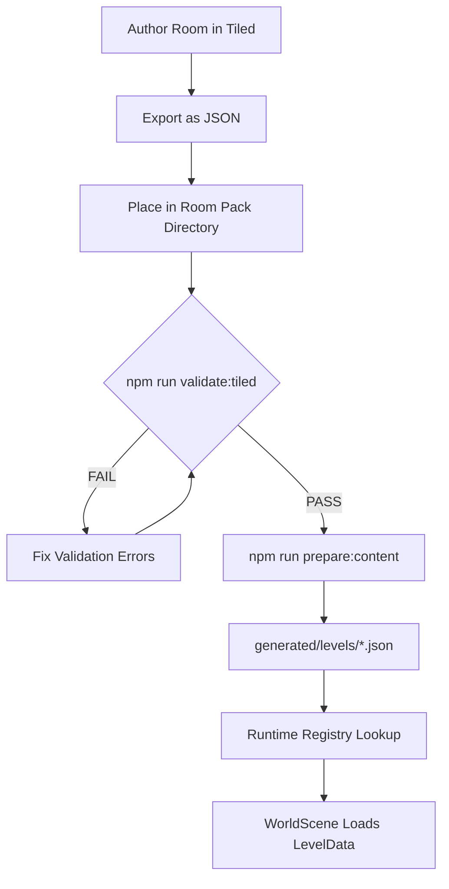

# Tiled Pipeline Contract

> **Status**: Canonical Specification  
> **Last Updated**: 2025-01-XX  
> **Supersedes**: LDtk pipeline for room authoring

This document defines the complete Tiled workflow contract for map authoring, validation, and compilation. It is the **authoritative specification** for all Tiled-based map work in kimbar.

---

## 1. Canonical Authored Map Location

### Primary Location

```
public/content/tiled/**
```

All authored Tiled maps MUST reside under `public/content/tiled/`. This directory is the **canonical source** for room definitions.

### Legacy Support

- LDtk files in `content/rooms/` remain **legacy/optional**
- New rooms MUST use Tiled format
- Existing LDtk rooms may be migrated incrementally

### File Format

- **Authored format**: Tiled JSON (`.json`) — NOT XML (`.tmx`)
- Tiled → Export As → JSON format
- JSON enables deterministic parsing and easier validation

---

## 2. Room Template Specification

### Template Location

```
public/content/tiled/templates/room-template.json
```

All new rooms SHOULD be created from this template to ensure layer compliance.

### Tile Size (Non-Negotiable)

| Property | Value |
|----------|-------|
| `tilewidth` | 32 |
| `tileheight` | 32 |

The 32×32 tile size is **non-negotiable**. All tilesets and maps MUST use this size.

### Required Layers

Every room MUST include these 6 layers (exact names, case-sensitive):

| Layer Name | Type | Purpose |
|------------|------|---------|
| `Floor` | Tile Layer | Base floor tiles |
| `Walls` | Tile Layer | Wall structures |
| `Trim` | Tile Layer | Decorative trim, molding |
| `Overlays` | Tile Layer | Above-player decorations |
| `Collision` | Tile Layer or Object Layer | Walkability/collision bounds |
| `Entities` | Object Layer | Spawnable objects (NPCs, doors, triggers) |

### Layer Order (Bottom to Top)

```
1. Floor      (renders first / bottom)
2. Walls
3. Trim
4. Collision  (may be invisible at runtime)
5. Overlays   (renders above player)
6. Entities   (object layer, not rendered as tiles)
```

---

## 3. Room Pack Directory Layout

Rooms are organized into **Room Packs** — thematic directories containing related rooms.

### Naming Convention

- Pack directories: `kebab-case` (e.g., `supreme-court`, `law-library`)
- Room files: `snake_case.json` (e.g., `lobby.json`, `courtroom_a.json`)

### Structure Example

```
public/content/tiled/
├── templates/
│   └── room-template.json
├── tilesets/
│   ├── collision.tsx
│   ├── scotus_decor.tsx
│   ├── scotus_floors.tsx
│   └── scotus_structures.tsx
├── tiles/
│   ├── scotus_decor.png
│   ├── scotus_floors.png
│   └── scotus_structures.png
├── schemas/
│   └── tiled_contract.schema.json
└── supreme-court/               # Room Pack
    ├── lobby.json
    ├── courtroom_a.json
    ├── chambers.json
    └── hallway.json
```

### Pack Metadata (Optional)

Each room pack MAY include a `_pack.json` manifest:

```json
{
  "id": "supreme-court",
  "displayName": "Supreme Court",
  "rooms": ["lobby", "courtroom_a", "chambers", "hallway"],
  "defaultSpawn": { "room": "lobby", "spawnId": "main" }
}
```

---

## 4. Entity Schema (Objects in Entities Layer)

All objects in the `Entities` layer MUST have a `type` property. The following entity types are supported:

### Entity Types

| Type | Required Properties | Optional Properties |
|------|---------------------|---------------------|
| `PlayerSpawn` | `spawnId` (string) | — |
| `Door` | `toMap` (string), `toSpawn` (string) | `facing` (string) |
| `NPC` | `characterId` (string) | `storyKnot` (string) |
| `EncounterTrigger` | `deckTag` (string), `count` (int), `once` (bool) | `rewardId` (string) |

### Entity JSON Examples

#### PlayerSpawn

Defines where the player appears when entering a room.

```json
{
  "id": 1,
  "name": "spawn_main",
  "type": "PlayerSpawn",
  "x": 256,
  "y": 384,
  "width": 32,
  "height": 32,
  "properties": [
    { "name": "spawnId", "type": "string", "value": "main" }
  ]
}
```

#### Door

Connects rooms via transitions.

```json
{
  "id": 2,
  "name": "door_to_courtroom",
  "type": "Door",
  "x": 480,
  "y": 128,
  "width": 64,
  "height": 32,
  "properties": [
    { "name": "toMap", "type": "string", "value": "supreme-court/courtroom_a" },
    { "name": "toSpawn", "type": "string", "value": "from_lobby" },
    { "name": "facing", "type": "string", "value": "up" }
  ]
}
```

**Facing values**: `up`, `down`, `left`, `right`

#### NPC

Spawns a character from the character registry.

```json
{
  "id": 3,
  "name": "npc_clerk",
  "type": "NPC",
  "x": 320,
  "y": 256,
  "width": 32,
  "height": 48,
  "properties": [
    { "name": "characterId", "type": "string", "value": "court_clerk" },
    { "name": "storyKnot", "type": "string", "value": "clerk_intro" }
  ]
}
```

**characterId**: Must match an entry in the character registry.  
**storyKnot**: Optional Ink knot to trigger on interaction.

#### EncounterTrigger

Triggers a flashcard encounter when the player enters the zone.

```json
{
  "id": 4,
  "name": "encounter_constitutional",
  "type": "EncounterTrigger",
  "x": 192,
  "y": 320,
  "width": 128,
  "height": 64,
  "properties": [
    { "name": "deckTag", "type": "string", "value": "constitutional-law" },
    { "name": "count", "type": "int", "value": 5 },
    { "name": "once", "type": "bool", "value": true },
    { "name": "rewardId", "type": "string", "value": "xp_small" }
  ]
}
```

**deckTag**: Filters cards by tag.  
**count**: Number of cards in the encounter.  
**once**: If true, trigger fires only once per session.

---

## 5. Tileset Rules

### Source Locations

Primary tileset assets reside in:

```
public/assets/tilesets/**    # Authored PNG atlases
public/content/tiled/tiles/  # Tiled-specific PNGs
public/content/tiled/tilesets/  # TSX tileset definitions
```

### Tile ID Stability (SACRED)

> **Tile IDs are APPEND-ONLY** — never reorder or delete tiles.

This invariant prevents tile corruption when maps reference GIDs:

- ✅ Add new tiles at the end of a tileset
- ❌ Remove tiles from an existing tileset
- ❌ Reorder tiles within a tileset
- ❌ Change tileset column count after maps reference it

### GID Drift Prevention

Compiled LevelData MUST NOT depend on raw GIDs. Store stable references:

```typescript
interface TileReference {
  tilesetKey: string;   // e.g., "scotus_floors"
  localTileId: number;  // Index within that tileset
}
```

This decouples map data from Tiled's internal GID numbering.

### Atlas Constraints

| Property | Limit |
|----------|-------|
| Max atlas size | 2048×2048 px |
| Tile size | 32×32 px |
| Format | PNG (indexed or RGBA) |

---

## 6. Compilation Output

### Generated Location

```
generated/levels/**/*.json
```

Compiled LevelData files are generated here and are **gitignored**.

### LevelData Schema

```typescript
interface LevelData {
  id: string;                    // e.g., "supreme-court/lobby"
  width: number;                 // Map width in tiles
  height: number;                // Map height in tiles
  tileSize: 32;                  // Always 32
  layers: {
    floor: number[][];           // 2D tile indices
    walls: number[][];
    trim: number[][];
    overlays: number[][];
    collision: CollisionData;    // Processed collision
  };
  entities: EntityData[];        // Parsed entity objects
  tilesets: TilesetReference[];  // Required tileset keys
}

interface EntityData {
  type: string;
  x: number;
  y: number;
  width: number;
  height: number;
  properties: Record<string, unknown>;
}

interface TilesetReference {
  key: string;
  firstGid: number;
}
```

### Compilation Requirements

- **Deterministic output**: Re-running compilation produces identical output
- **Stable ordering**: Entities sorted by ID, tilesets by firstGid
- **Registry-addressable**: All LevelData accessible via registry lookup

---

## 7. Validation Rules

All maps MUST pass validation before compilation.

### Required Checks

| Check | Rule |
|-------|------|
| Layer presence | All 6 required layers exist |
| Layer names | Exact case-sensitive match |
| Tile size | Map and all tilesets use 32×32 |
| Entity types | All objects have valid `type` |
| Entity properties | Required properties present per type |
| No `__MACOSX` | Directories with this name cause failure |
| Tileset references | All referenced tilesets resolvable |

### Validation Command

```bash
npm run validate:tiled
```

### Error Examples

```
ERROR: Map "lobby.json" missing required layer: Collision
ERROR: Entity "door_1" missing required property: toMap
ERROR: Found __MACOSX directory in public/assets/tilesets/lpc/
ERROR: Tileset "missing_tileset" not found
```

### `__MACOSX` Guard

The presence of `__MACOSX` directories anywhere in map or asset directories MUST cause validation failure with a clear error:

```
FATAL: __MACOSX directory detected at: public/assets/tilesets/lpc/__MACOSX
       These directories are macOS artifacts and must be removed.
       Run: find public -type d -name "__MACOSX" -exec rm -rf {} +
```

---

## 8. Acceptance Criteria

### Pipeline Success

- [ ] `npm run validate` succeeds for all maps
- [ ] `npm run prepare:content` compiles maps to `generated/levels/`
- [ ] Compiled output is deterministic (no noisy diffs on re-run)
- [ ] Runtime loads LevelData via registry (no hardcoded paths)
- [ ] `__MACOSX` presence causes validation failure with clear error

### Authoring Checklist

Before committing a new room:

1. [ ] Created from `templates/room-template.json`
2. [ ] All 6 required layers present
3. [ ] Tile size is 32×32
4. [ ] All entities have valid `type` and required properties
5. [ ] `npm run validate:tiled` passes
6. [ ] No `__MACOSX` directories in commit

---

## 9. Pipeline Flow Diagram



---

## 10. Migration from LDtk

For existing LDtk rooms, the migration path is:

1. Create equivalent Tiled room from template
2. Recreate tile placements on appropriate layers
3. Add entity objects for spawns, doors, NPCs
4. Validate with `npm run validate:tiled`
5. Update any hardcoded references to use registry
6. Remove LDtk source file after verification

LDtk files in `content/rooms/` are deprecated but supported for backward compatibility.

---

## Related Documentation

- [`public/content/tiled/README.md`](../public/content/tiled/README.md) — Tiled directory overview
- [`docs/TILED_SCAFFOLD_INVENTORY.md`](./TILED_SCAFFOLD_INVENTORY.md) — Asset inventory
- [`docs/INVARIANTS.md`](./INVARIANTS.md) — Sacred project invariants
- [`schemas/*.schema.json`](../schemas/) — JSON Schema definitions
